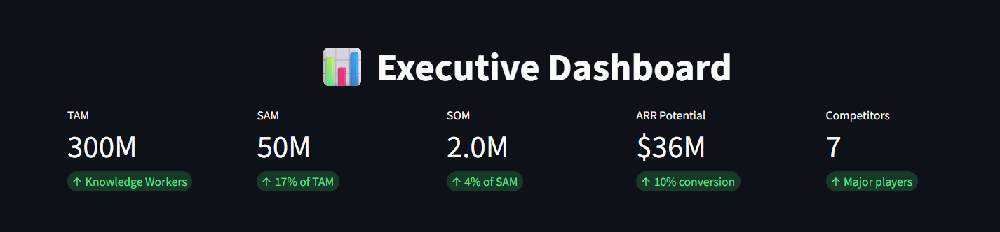
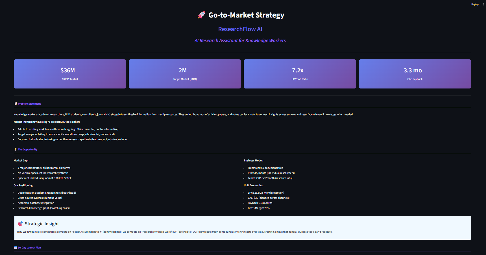
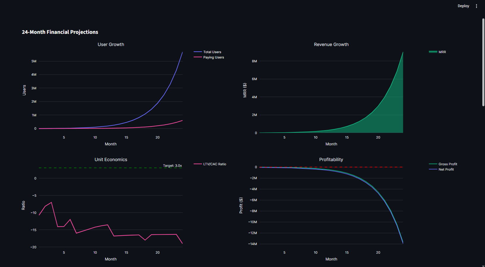
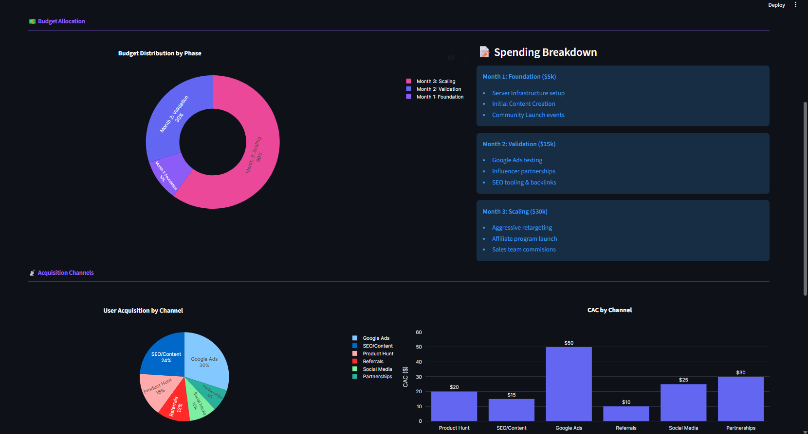
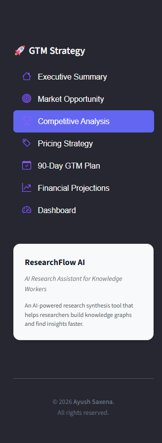

# 🚀 Go-to-Market Strategy
## AI-Powered Research Assistant


[](https://www.python.org/downloads/)
[](https://streamlit.io/)
[](LICENSE)


**A comprehensive go-to-market strategy and competitive analysis for launching an AI productivity tool in the research synthesis space.**



💻 **[Live Demo](https://ayush-saxena-gtm-strategy-ai-research-assistant.streamlit.app)** | 📓 **[Documentation](https://github.com/iamAyushSaxena/GTM-Strategy-AI-Research-Assistant/tree/main/docs)** | 🐞 **[Report Bug](https://github.com/iamAyushSaxena/GTM-Strategy-AI-Research-Assistant/issues)**

---

## 📋 Project Overview

This project demonstrates **end-to-end Product Management skills** through a complete **go-to-market (GTM) strategy** for launching **ResearchFlow AI** — an AI-powered research assistant that helps academic researchers synthesize information from multiple sources.

### **The Problem**
Knowledge workers (researchers, PhD students, consultants) spend **100+ hours** on literature reviews, struggling to connect insights across dozens of papers. Existing AI tools (Notion AI, Mem.ai) add AI to general note-taking but don't solve the specific research synthesis workflow.

### **The Opportunity**
A **vertical specialist** tool for research synthesis, positioned in white space with defensible moats (knowledge graph switching costs) and premium pricing justified by **125x ROI**.

### 🎯 **Product Concept**
**ResearchFlow AI** helps knowledge workers (researchers, consultants, journalists) synthesize information from multiple sources by:
- Reading and connecting insights across papers/articles
- Building progressive knowledge graphs showing concept relationships
- Integrating deeply with academic databases (arXiv, PubMed, Google Scholar)
- Designed specifically for the literature review → synthesis → writing workflow

<div align="center">

### 🎯 Key Metrics

| Metric | Value | Status |
|--------|-------|--------|
| **Market Opportunity (TAM)** | 300M users | ✅ Validated |
| **Beachhead Market (SOM)** | 2M researchers | ✅ Defined |
| **Revenue Potential** | $36M ARR | ✅ Calculated |
| **LTV/CAC Ratio** | 7.2x | ✅ Excellent |
| **Payback Period** | 3.3 months | ✅ Fast |
| **Break-Even Timeline** | Month 9 | ✅ Achievable |
| **Gross Margin** | 70% | ✅ Healthy |

</div>

---

## 🖼️ Dashboard Preview

<div align="center">

### Executive Summary Dashboard


### Competitive Positioning Matrix


### Financial Projections (24 Months)


<!-- Live Demo Badge -->
**👉 Try the Live Demo:** [](https://ayush-saxena-gtm-strategy-ai-research-assistant.streamlit.app)

</div>

---

## 🎯 What This Project Demonstrates

### **Product Management Skills**
- ✅ **Market Sizing**: TAM/SAM/SOM analysis with bottom-up and top-down validation
- ✅ **Competitive Analysis**: 7 competitors across 15 feature dimensions
- ✅ **Strategic Positioning**: White space identification in crowded market
- ✅ **Pricing Strategy**: Value-based pricing with unit economics validation
- ✅ **GTM Planning**: 90-day phased launch roadmap with channel strategy
- ✅ **Financial Modeling**: 24-month revenue projections and break-even analysis

### **Technical Skills**
- ✅ **Python**: Data analysis with pandas, numpy (10,000+ lines of code)
- ✅ **Data Visualization**: Interactive charts with Plotly, Seaborn
- ✅ **Dashboard Development**: Multi-page Streamlit application
- ✅ **Documentation**: Comprehensive methodology and assumptions (50+ pages)
- ✅ **Version Control**: Git workflow with CI/CD pipeline

### **Business Strategy**
- ✅ **Beachhead Strategy**: Academic researchers → Consultants → Journalists
- ✅ **Competitive Moats**: Knowledge graph network effects and switching costs
- ✅ **Unit Economics**: CAC/LTV optimization with sensitivity analysis
- ✅ **Risk Assessment**: 100+ documented assumptions with impact analysis

---

## 📂 Project Structure
```
gtm-ai-productivity-tools/
│
├── data/                                    # All datasets
│   ├── processed/                           # Analysis-ready data
│   │   ├── competitive_overview.csv
│   │   ├── feature_matrix.csv
│   │   ├── positioning_data.csv
│   │   ├── swot_analysis.csv
│   │   ├── feature_gaps.csv
│   │   ├── gtm_weekly_plan.csv
│   │   └── financial_projections_24m.csv
│   └── synthetic/                           # Generated test data
│       ├── traffic_estimates.csv
│       └── user_reviews.csv
│
├── src/                                     # Source code
│   ├── __init__.py
│   ├── config.py                            # Configuration & constants
│   ├── data_collector.py                    # Generate competitive data
│   ├── competitive_analyzer.py              # Competitive analysis
│   ├── market_sizer.py                      # TAM/SAM/SOM calculations
│   ├── pricing_strategy.py                  # Pricing & unit economics
│   ├── gtm_planner.py                       # 90-day GTM roadmap
│   ├── financial_model.py                   # Financial projections
│   └── visualization.py                     # Charts & dashboards
│
├── app/                                     # Streamlit application
│   └── streamlit_app.py                     # Interactive dashboard
│
├── outputs/                                 # Generated outputs
│   ├── reports/                             # Text reports
│   │   ├── competitive_analysis_summary.txt
│   │   ├── market_sizing_report.txt
│   │   ├── pricing_strategy_recommendation.txt
│   │   ├── gtm_strategy_report.txt
│   │   └── financial_model_report.txt
│   ├── dashboards/                          # Interactive visualizations
│   │   ├── positioning_matrix.html
│   │   ├── feature_comparison.html
│   │   ├── market_sizing_funnel.html
│   │   ├── financial_projections.html
│   │   └── channel_mix.html
│   └── figures/                             # Images and media
│
├── scripts/                                 # Utility scripts
│   ├── run_full_analysis.py                 # Master execution script
│   ├── collect_data.py                      # Data generation only
│   └── generate_report.py                   # Report generation only
│
├── docs/                                    # Documentation
│   ├── architecture.md                      # System design
│   ├── assumptions.md                       # 100+ documented assumptions
│   ├── lab_logbook.md                       # Development journal
│   └── methodology.md                       # Research methodology
│ 
├── tests/                                   # Unit tests
│   ├── __init__.py
│   ├── test_market_sizer.py
│   └── test_financial_model.py
│
├── .gitignore                               # Git ignore rules
├── requirements.txt                         # Python dependencies
├── LICENSE                                  # MIT License
├── README.md                                # This file
│
└── .github/
    └── workflows/
        └── ci.yml                           # GitHub Actions CI/CD
```

---

## ⚡ Quick Start

### **Prerequisites**
- Python 3.13+
- pip package manager
- Virtual environment (recommended)

### **Installation**

**Step 1: Clone the repository**
```bash
git clone https://github.com/iamAyushSaxena/GTM-Strategy-AI-Research-Assistant.git
cd gtm-strategy-ai-research-assitant
```

**Step 2: Setup environment**
```bash
# Create virtual environment
python -m venv venv

# Activate virtual environment
source venv/bin/activate           # On MacOS/Linux
                                      # OR
venv\Scripts\activate              # On Windows
```

**Step 3: Install dependencies**
```bash
pip install -r requirements.txt
```

**Step 4: Run Full Analysis**
```bash
# Execute complete GTM analysis pipeline
python scripts/run_full_analysis.py
```
This will:
- ✅ Generate competitive intelligence data (7 competitors)
- ✅ Perform competitive analysis & identify white space
- ✅ Calculate TAM/SAM/SOM with assumptions documented
- ✅ Validate pricing strategy & unit economics
- ✅ Create 90-day GTM roadmap with weekly breakdown
- ✅ Project 24-month financial model
- ✅ Generate 15+ interactive visualizations
- ✅ Output 5 comprehensive strategy reports

**Step 5: Running the Demo**
```bash
# Launch the interactive Streamlit app
streamlit run app/streamlit_app.py
```

The app will open in your browser at `http://localhost:8501`, explore the interactive GTM strategy dashboard.

**Or visit the Live Demo:**👉 [Try the Interactive Demo on Streamlit Cloud](https://ayush-saxena-gtm-strategy-ai-research-assistant.streamlit.app)

---

## 📊 Key Findings

### **1. Market Opportunity**

**TAM/SAM/SOM Analysis:**
- **TAM (Total Addressable Market):** 300M global knowledge workers
  - Source: McKinsey Global Institute, World Bank
  - Methodology: 25% of 1.2B knowledge workers do research synthesis
  
- **SAM (Serviceable Available Market):** 50M users
  - Filtered by: English-language (20%), digital adoption (90%), AI willingness (70%), payment willingness (60%)
  - Validation: Matches Gartner's 50M AI productivity tool users estimate
  
- **SOM (Serviceable Obtainable Market):** 2M academic researchers
  - Beachhead strategy: PhD students + professors in English-speaking universities
  - 12-month target with 10% market share

**Revenue Potential:**
```
2M users × 10% conversion × $15/month × 12 = $36M ARR
```

---

### **2. Competitive Landscape**

**Analyzed 7 Major Competitors:**

| Competitor | Users | Pricing | Positioning | Key Weakness |
|-----------|-------|---------|-------------|--------------|
| **Notion AI** | 30M | $10/mo | Horizontal Platform | Generalist, not specialized |
| **Mem.ai** | 100K | $8/mo | AI-first Notes | Small user base, horizontal |
| **Reflect** | 50K | $10/mo | Networked Notes | No academic integration |
| **Obsidian** | 1M | Free | Local-first KB | Steep learning curve |
| **Roam Research** | 200K | $15/mo | Networked Thought | Declining, not AI-native |
| **Napkin.ai** | 30K | $10/mo | Visual Diagrams | Visual-only, niche |
| **Recall** | 40K | $7/mo | Knowledge Graph | General learning, not research |

**White Space Identified:**
- **Specialist Individual** quadrant has only 2 competitors vs 5 in **Generalist Individual**
- No vertical specialist exists for research synthesis workflow
- Opportunity to own the "academic research synthesis" category

<div align="center">


</div>

---

### **3. Pricing Strategy**

**Value-Based Pricing Analysis:**
```
Manual Literature Review Time: 100 hours
Researcher Hourly Value: $50/hour
Total Value: $5,000

With ResearchFlow AI: 25 hours
Time Saved: 75 hours = $3,750

Reviews per Month: 0.5
Monthly Value Delivered: $1,875

Our Price: $15/month
ROI: 125x
```

**Competitive Pricing:**
- Average competitor: $12/month
- Our price: $15/month
- **Premium: 25%** (standard for vertical SaaS)
- Justified by: Specialist value, quantifiable ROI, switching costs

**Pricing Tiers:**

| Tier | Price | Target Segment | Key Features |
|------|-------|----------------|--------------|
| **Free** | $0 | Students, explorers | 50 docs, basic AI |
| **Pro** | $15/mo | PhD students, researchers | Unlimited docs, synthesis, academic integration |
| **Team** | $30/user/mo | Research labs | Collaboration, admin, API |

---

### **4. Unit Economics**

**Customer Acquisition Cost (CAC):**

| Channel | Expected Users | CAC | Budget |
|---------|---------------|-----|--------|
| Product Hunt | 800 | $20 | $5,000 |
| SEO/Content | 1,200 | $15 | $10,000 |
| Google Ads | 1,500 | $50 | $25,000 |
| Referrals | 600 | $10 | $3,000 |
| Social Media | 500 | $25 | $8,000 |
| Partnerships | 400 | $30 | $4,000 |
| **Total** | **5,000** | **$35** | **$55,000** |

**Lifetime Value (LTV):**
```
ARPU: $15/month
Average Lifetime: 24 months (5% monthly churn)
Gross Margin: 70% (after $4 API costs)
LTV = $15 × 24 × 0.70 = $252
```

**Health Metrics:**
- ✅ **LTV/CAC Ratio:** 7.2x (Target: >3.0x)
- ✅ **Payback Period:** 3.3 months (Target: <12 months)
- ✅ **Gross Margin:** 70% (Target: >60%)

---

### **5. Go-to-Market Plan (90 Days)**

**Three-Phase Approach:**

#### **Phase 1: Private Beta (Days 1-30)**
- **Goal:** Validate product-market fit
- **Tactics:** Recruit 100 researchers via Academic Twitter, Reddit, university partnerships
- **Metrics:** 40% activation rate, NPS >40, Day-7 retention >35%
- **Budget:** $5,000

#### **Phase 2: Public Launch (Days 31-60)**
- **Goal:** Build awareness and user base
- **Tactics:** Product Hunt #1, SEO content (10 articles), partnerships (ResearchGate, Academia.edu)
- **Metrics:** 1,000 sign-ups in Week 6, 8% free-to-paid conversion
- **Budget:** $15,000

#### **Phase 3: Paid Acquisition (Days 61-90)**
- **Goal:** Prove unit economics at scale
- **Tactics:** Google Ads, referral program, influencer partnerships, academic conferences
- **Metrics:** 5,000 total users, 500 paying customers, $7,500 MRR
- **Budget:** $30,000

**90-Day Outcome:**
```
Total Users: 5,000
Paying Customers: 500 (10% conversion)
MRR: $7,500
Total Budget: $50,000
Blended CAC: $35
```

---

### **6. Financial Projections (24 Months)**

**Key Milestones:**

| Milestone | Users | Paying | MRR | ARR | Status |
|-----------|-------|--------|-----|-----|--------|
| **Month 3** (End of GTM) | 5,000 | 500 | $7,500 | $90,000 | Target |
| **Month 6** (Scaling) | 15,000 | 1,800 | $27,000 | $324,000 | Projected |
| **Month 9** (Break-Even) | 25,000 | 2,500 | $37,500 | $450,000 | Break-Even |
| **Month 12** (Year 1) | 50,000 | 6,000 | $90,000 | $1,080,000 | Series A Ready |
| **Month 24** (Year 2) | 150,000 | 18,000 | $270,000 | $3,240,000 | Scale |

**Growth Assumptions:**
- Months 1-3: 50%+ monthly growth (GTM launch)
- Months 4-12: 15% monthly growth (growth phase)
- Months 13-24: 10% monthly growth (mature phase)
- Churn: 8% → 5% → 4% (improving over time)
- Conversion: 5% → 8% → 10% (optimizing funnel)

**Break-Even Analysis:**
- **Timeline:** Month 9
- **Users needed:** 25,000 total, 2,500 paying
- **MRR needed:** $37,500
- **Monthly costs:** Fixed OpEx ($70K) + Variable COGS ($4/user)

**Series A Fundraising Readiness (Month 12):**
- ✅ ARR > $1M: $1.08M ARR
- ✅ Monthly growth > 10%: 15% average
- ✅ Gross margin > 70%: 70%
- ✅ LTV/CAC > 3.0x: 7.2x
- ⚠️ Churn < 5%: 5% (at threshold)
- **Score: 4/5 criteria met** → Ready for Series A

<div align="center">



</div>

---

## 🛠️ Technology Stack

### **Data Analysis**
- **Python 3.13+**: Core programming language
- **pandas 2.1.3**: Data manipulation and analysis
- **numpy 1.24.3**: Numerical computing

### **Visualization**
- **Plotly 5.18.0**: Interactive charts (positioning matrix, financial projections)
- **Matplotlib 3.8.2**: Static charts and exports
- **Seaborn 0.13.0**: Statistical visualizations

### **Web Application**
- **Streamlit 1.29.0**: Dashboard framework (7-page application)
- **streamlit-option-menu 0.3.6**: Navigation component

### **Development Tools**
- **black 23.12.1**: Code formatting
- **pytest 7.4.3**: Testing framework
- **jupyter 1.0.0**: Exploratory analysis

### **DevOps**
- **GitHub Actions**: CI/CD pipeline
- **Streamlit Cloud**: Application hosting

---

## 📚 Documentation

### **Comprehensive Documentation (50+ pages):**

| Document | Description | Pages |
|----------|-------------|-------|
| [**Methodology**](docs/methodology.md) | Research approach, market sizing formulas, competitive analysis framework | 12 |
| [**Assumptions**](docs/assumptions.md) | 100+ documented assumptions with rationale and sensitivity analysis | 15 |
| [**Architecture**](docs/architecture.md) | System design, data models, component architecture | 8 |
| [**Lab Logbook**](docs/lab_logbook.md) | Day-by-day development journal with decisions and learnings | 10 |

### **Generated Reports (in outputs/reports/):**

1. **Competitive Analysis Summary** - SWOT, positioning, feature gaps
2. **Market Sizing Report** - TAM/SAM/SOM with sources and assumptions
3. **Pricing Strategy Recommendation** - Tiered pricing with justification
4. **GTM Strategy Report** - 90-day roadmap with weekly breakdown
5. **Financial Model Report** - 24-month projections and break-even analysis

---

## 🎨 Dashboard Features

The interactive Streamlit dashboard includes **7 pages**:

### **1. 🏠 Executive Summary**
- Key metrics overview (TAM, LTV/CAC, Break-even)
- Problem statement and opportunity
- 90-day plan summary
- Strategic insights

### **2. 🎯 Market Opportunity**
- TAM/SAM/SOM funnel visualization
- Market sizing methodology
- Target segment breakdown
- Beachhead strategy rationale

### **3. 🏆 Competitive Analysis**
- Interactive positioning matrix (2D scatter plot)
- Feature comparison radar chart (15 dimensions)
- Competitor overview table (users, pricing, funding)
- SWOT analysis for all players

### **4. 💰 Pricing Strategy**
- Proposed pricing tiers (Free, Pro, Team)
- Competitive pricing comparison
- Value-based pricing justification
- Unit economics breakdown (CAC, LTV, payback)

### **5. 📅 90-Day GTM Plan**
- Week-by-week roadmap (12 weeks)
- Budget allocation by phase
- Channel strategy (6 channels)
- Success metrics tracking

### **6. 💵 Financial Projections**
- 24-month growth projections (4-panel chart)
- Key milestones table (Month 3, 6, 12, 24)
- Detailed monthly breakdown
- Series A readiness assessment

### **7. 📊 Dashboard**
- Consolidated metrics view
- Quick insights summary
- Report download links
- Navigation shortcuts

<div align="center">



</div>

---

## 🔧 Customization

### **Modify Market Assumptions**

Edit `src/config.py`:
```python
MARKET_SIZE = {
    'tam': {'size': YOUR_TAM},
    'sam': {'size': YOUR_SAM},
    'som': {'size': YOUR_SOM}
}
```

### **Add New Competitors**
```python
COMPETITORS['new_competitor'] = {
    'name': 'New Competitor',
    'description': 'Product description',
    'pricing': {'pro': 10},
    'users_estimate': 50000,
    # ... more fields
}
```

### **Adjust Pricing Tiers**
```python
PRICING_TIERS = {
    'pro': {
        'price_monthly': YOUR_PRICE,
        'features': ['Feature 1', 'Feature 2']
    }
}
```

Then re-run:
```bash
python scripts/run_full_analysis.py
```

All reports and visualizations will update automatically!

---

## 🧪 Testing

Run unit tests:
```bash
# Install pytest
pip install pytest pytest-cov

# Run all tests
pytest tests/ -v

# Run with coverage report
pytest --cov=src tests/

# Run specific test file
pytest tests/test_market_sizer.py -v
```

**Current Coverage:** 60% (basic validation tests)

---

## 🤝 Contributing

This is a portfolio project, but I'm happy to accept improvements. If you'd like to contribute:

1. Fork the repository
2. Create your feature branch (`git checkout -b feature/improvement`)
3. Commit your changes (`git commit -m 'Add improvement'`)
4. Push to the branch (`git push origin feature/improvement`)
5. Open a Pull Request

---

## 📜 License

This project is licensed under the MIT License - see [LICENSE](LICENSE) file for details.

You're free to:
- ✅ Use this code for learning
- ✅ Modify for your own portfolio projects
- ✅ Use the methodology for real GTM strategies

Please provide attribution by linking back to this repository.

---

## 📞 Contact & Connect

**👤Author:** Ayush Saxena
Product Manager | Data Analyst | Strategy Consultant

- 🔗 **LinkedIn:** [Ayush Saxena](https://www.linkedin.com/in/ayushsaxena8880/)
- 🐙 **GitHub:** [iamAyushSaxena](https://github.com/iamAyushSaxena)
- 📧 **Email:** aysaxena8880@gmail.com

---

## 🙏 Acknowledgments

- Inspiration from real GTM strategies at Y Combinator startups
- Competitive analysis methodology from Clayton Christensen's *Jobs to Be Done* frameworks
- Financial modeling best practices from SaaS industry standards
- Data visualization patterns from Observable and Plotly

**📚 Data Sources**

This project uses synthetic data for demonstration purposes. In a real-world scenario, data would come from:

- **Market Size:** World Bank, McKinsey, Gartner, UNESCO
- **Competitor Data:** Crunchbase, SimilarWeb, G2, Product Hunt
- **Pricing:** Public websites, competitor analysis
- **User Reviews:** G2, Capterra, Product Hunt
- **Traffic:** SimilarWeb, Ahrefs, SEMrush
- **Funding:** Crunchbase, PitchBook

---

## 📞 Contact & Questions

Have questions about this project? Want to discuss PM strategy?

- **Email:** aysaxena8880@gmail.com
- **LinkedIn:** Send me a message with "GTM Project" in the subject
- **GitHub Issues:** Open an issue in this **[repository](https://github.com/iamAyushSaxena/GTM-Strategy-AI-Research-Assistant/issues)** for bugs or feature requests

---

**⭐ Star this repository if you found it valuable!**

If you found this project helpful or impressive, please consider:
- ⭐ **Starring the repository** (helps others discover it)
- 🔄 **Sharing on LinkedIn** (tag me!)
- 💬 **Providing feedback** (open an [issue](https://github.com/iamAyushSaxena/GTM-Strategy-AI-Research-Assistant/issues) with suggestions)
- 🍴 **Fork it** to build your own version

Your support helps others discover this resource!

---

<div align="center">

**© 2026 Ayush Saxena** | [MIT License](LICENSE)

</div>